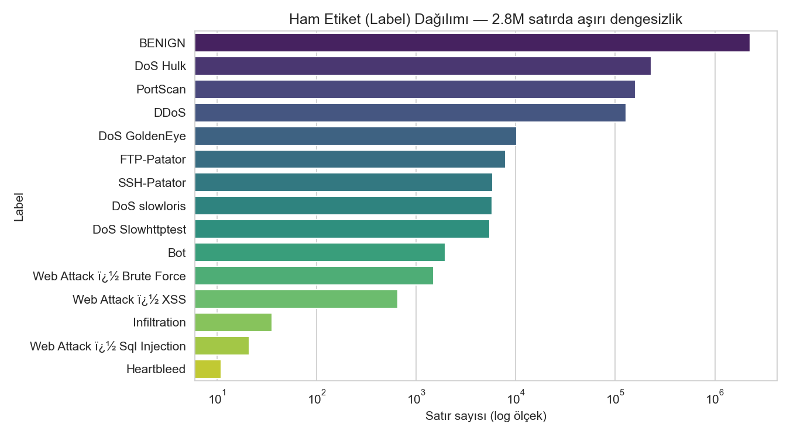
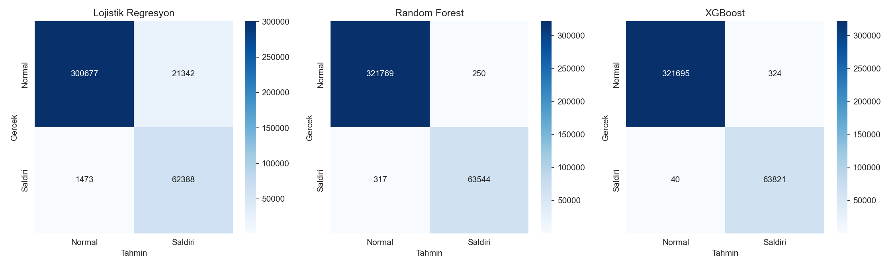
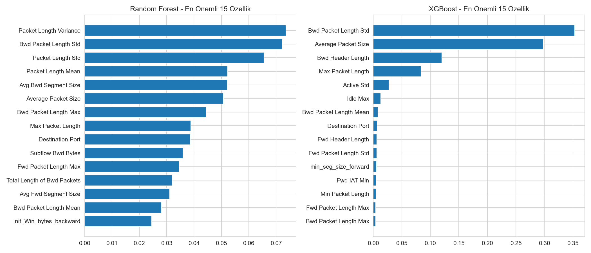
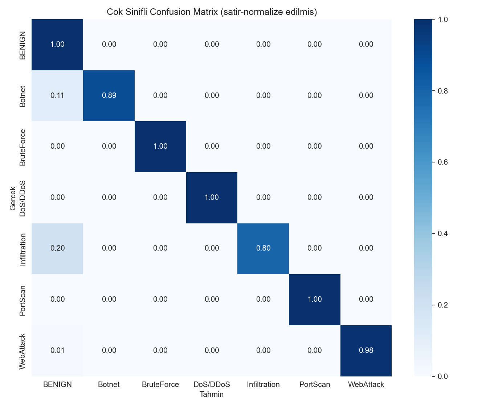

# Yapay Zeka Destekli Ağ Saldırı Tespit Sistemi — Teknik Rapor

**Proje:** ml-network-ids
**Repo:** https://github.com/canci01/ml-network-ids

---

## 1. Özet

Bu çalışmada, CICIDS2017 ağ trafiği veri setiyle eğitilmiş, sızıntısız bir deney kurulumuna sahip bir saldırı tespit sistemi geliştirilmiştir. 2.572.527 satırlık temizlenmiş veri üzerinde Lojistik Regresyon, Random Forest ve XGBoost karşılaştırılmış; XGBoost hem en hızlı (59 saniye) hem en yüksek recall'a (%99.94) ulaşan model olmuştur. Aynı model 7 saldırı kategorisiyle çok sınıflı olarak yeniden eğitilmiş, makro F1 skoru 0.940'a ulaşmıştır. Sonuçlar bir Gradio demosunda sunulmuştur.

## 2. Giriş ve Motivasyon

Geleneksel imza tabanlı saldırı tespit sistemleri sadece bilinen saldırı kalıplarını yakalayabilir. Makine öğrenmesi tabanlı yaklaşımlar, ağ akışı istatistiklerinden öğrenerek daha esnek bir tespit sağlayabilir; ancak IDS literatüründe sıkça karşılaşılan bir sorun, hatalı deney kurulumundan kaynaklanan yapay olarak şişirilmiş başarı skorlarıdır (ör. kimlik sütunlarının sızması). Bu proje, hem güçlü bir sınıflandırma performansı elde etmeyi hem de bu sızıntı risklerini açıkça test edip raporlamayı amaçlar.

## 3. Veri

**CICIDS2017** (Kaggle aynası: chethuhn/network-intrusion-dataset, CC0): 8 günlük gerçekçi trafik, 2.830.743 satır, 78 flow özelliği, BENIGN + 14 saldırı alt türü.

**Temizleme adımları** (`src/load_data.py`, `src/clean.py`):
- Sütun adlarındaki boşluklar temizlendi, dtype'lar küçültüldü (float64→float32).
- `Flow Bytes/s` ve `Flow Packets/s` sütunlarındaki Inf değerleri (%0.1) ve negatif değerler (113 satır, CICFlowMeter'in bilinen bir üretim hatası) temizlendi.
- 8 sabit sütun ve 1 kopya sütun (`Fwd Header Length.1`) silindi.
- Tam kopya satırlar (%9.03) atıldı.
- 14 alt saldırı türü, alt string eşlemesiyle (kaynak veride "Web Attack" etiketlerinde bir encoding bozukluğu tespit edildiği için) 7 ana kategoriye (BENIGN, DoS/DDoS, PortScan, BruteForce, WebAttack, Botnet, Infiltration) indirgendi.

**Sonuç:** 2.572.527 satır. Sınıf dağılımı aşırı dengesiz: BENIGN %83, en nadir sınıf Infiltration sadece 36 satır (Şekil 1).

**EDA'da öne çıkan bulgu:** İlk varsayımımız "SYN Flag Count saldırı trafiğinde yüksektir" şeklindeydi; sayısal doğrulamada bunun **yanlış** olduğu ortaya çıktı (BENIGN'de %5.5, saldırıda %1.2 — sadece Infiltration ve BruteForce alt kümelerinde yüksek). Gerçek ayırt edici özellikler `Average Packet Size`, `Flow Bytes/s` ve `Fwd Packets/s` oldu — saldırı trafiği çok daha küçük paketlerle, düşük bayt hızında akıyor.

## 4. Sızıntısız Deney Kurulumu

`src/features.py` içinde şu kurallara uyulmuştur: (1) kimlik/meta sütunlar (`source_file`) özellik olarak kullanılmaz, (2) `StandardScaler` sadece train verisiyle fit edilir, (3) %70/%15/%15 stratified split, `random_state=42`. `Destination Port`'un olası sızıntı riski özellikle test edilmiş; XGBoost'un toplam öneminin sadece %0.7'sini oluşturduğu (eşik: %30) doğrulanarak güvenle dahil edilmesine karar verilmiştir.

## 5. İkili Sınıflandırma Sonuçları

| Model | Accuracy | Precision | Recall | F1 | ROC-AUC | Süre |
|---|---|---|---|---|---|---|
| Lojistik Regresyon | 0.9409 | 0.7451 | 0.9769 | 0.8454 | 0.9885 | 377s |
| Random Forest | 0.9985 | 0.9961 | 0.9950 | 0.9956 | 0.9997 | 256s |
| **XGBoost** | **0.9991** | 0.9949 | **0.9994** | **0.9972** | **1.0000** | **59s** |

IDS'te odak metrik **recall**'dur (kaçırılan saldırı en pahalı hatadır). XGBoost, 63.861 test saldırısından sadece 40'ını kaçırmıştır (recall %99.94) — üç model arasında en iyi sonuç.

**Özellik önemi:** En önemli 5 özellik (`Bwd Packet Length Std`, `Average Packet Size`, `Bwd Header Length`, `Max Packet Length`, `Active Std`) EDA bulgularıyla tutarlı şekilde paket boyutu ve zamanlama örüntülerine işaret etmektedir (Şekil 3).

## 6. Çok Sınıflı Sınıflandırma Sonuçları

XGBoost, 7 kategoriyle yeniden eğitilmiştir. SMOTE, sadece train setine ve sadece az örnekli sınıfları (5000'e kadar) hedefleyen kısıtlı bir stratejiyle uygulanmış, makro F1'i 0.9374'ten 0.9398'e çıkarmıştır ve nihai model olarak seçilmiştir. Ağırlıklı F1: 0.999.

**Hata analizi:** Farklı saldırı **türleri** birbiriyle neredeyse hiç karışmıyor — BruteForce, DoS/DDoS ve PortScan diyagonalde tam 1.00. Asıl hata deseni az örnekli sınıfların (Botnet: %11.3, WebAttack: %1.2, Infiltration: 1/5 örnek) BENIGN olarak kaçırılmasıdır — bu, model hatasından çok, bu sınıflardaki eğitim örneği kıtlığının doğal bir sonucudur.

## 7. Sonuç ve Gelecek Çalışmalar

XGBoost, hem hız hem de recall açısından en güvenilir seçim olarak öne çıkmıştır. Sızıntı kontrolü (`Destination Port` testi) modelin gerçek trafik örüntülerine dayandığını, ezber yapmadığını göstermektedir.

**Sınırlılıklar:** CICIDS2017 laboratuvar ortamında üretilmiş bir veri setidir, gerçek ağ trafiğinin çeşitliliğini tam yansıtmayabilir; kavram kayması (saldırı tekniklerinin zamanla evrilmesi) test edilmemiştir; gerçek zamanlı akış işleme kapsam dışıdır; aşırı az örnekli sınıflar (Infiltration) için güvenilir genelleme değerlendirmesi yapılamamaktadır.

**Gelecek çalışmalar:** (1) UNSW-NB15 ile çapraz veri seti doğrulaması (planlanmış ama zaman kısıtı nedeniyle bu sürümde yapılmamıştır), (2) SHAP ile daha derin açıklanabilirlik analizi, (3) gerçek zamanlı akış entegrasyonu.
